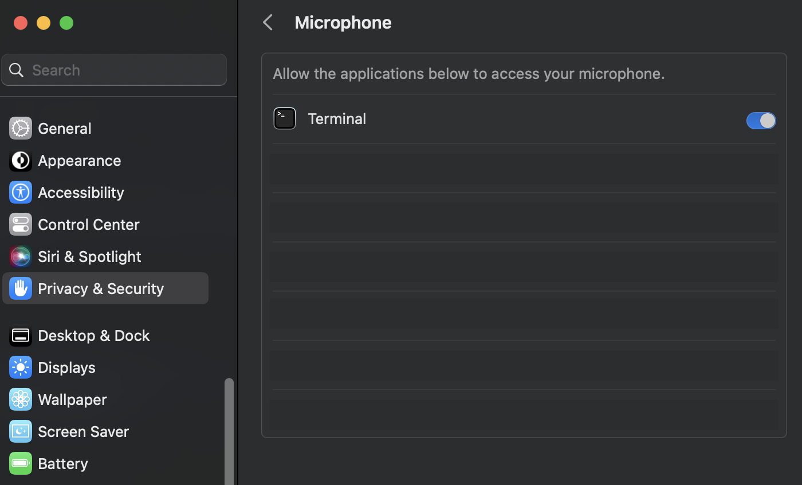

# Multilingual Dictation App based on Faster Whisper

This is based on the awesome work by https://github.com/guillaumekln/faster-whisper, https://github.com/foges/whisper-dictation and various PRs in the later repo

Multilingual dictation app based on the Faster Whisper to provide accurate and efficient speech-to-text conversion in any application. The app runs in the background and is triggered through a keyboard shortcut. It is also entirely offline, so no data will be shared. It allows users to set up their own keyboard combinations and choose from different Whisper models, and languages.

## Quick start
1. Run the app, switch to another application that accepts text input (editor, browser textarea, etc)
2. Use the key combination to toggle dictation.
Default to double-tapping right-cmd on macOS, right-super on Linux and Win+Z on Windows.
3. Say what you want to type, when done, use the same key combo to stop dictation and the app will transcribe and auto type the words on your behalf.

## Prerequisites
The PortAudio library is required for this app to work. You can install it on macOS using the following command:

```bash
brew install portaudio             # on MacOS

sudo apt install portaudio19-dev   # on Debian/Ubuntu Linux
```

## Permissions
The app requires accessibility permissions to register global hotkeys and permission to access your microphone for speech recognition.

For example, if you launch the app from MacOS terminal, you need to grant permission at Settings > Privacy & Security > Microphone
and Input Monitoring



## Installation
Clone the repository:

```bash
git clone https://github.com/doctorguile/faster-whisper-dictation.git
cd faster-whisper-dictation
```

Create a virtual environment:

```bash
python3 -m venv venv

source venv/bin/activate      # MacOS / Linux

venv\scripts\activate.bat     # Windows cmd.exe

```

Install the required packages:

```bash
pip3 install -r requirements.txt
```

## Usage

By default, the app uses the "base" model. You can change the model and specify a different key combination using command-line arguments.

Run the application:

```bash
python3 dictation.py -m small --key-combo="<ctrl>+<alt>+y"
```

## Options
```bash

python3 dictation.py [-h] [-m MODEL_NAME] [-k KEY_COMBO] [-d DOUBLE_KEY] [-t MAX_TIME] [-v DEVICE] [-c COMPUTE_TYPE]

  -h, --help            show this help message and exit
  -m MODEL_NAME, --model-name MODEL_NAME
                        Size of the model to use (tiny, tiny.en, base, base.en, small, small.en, medium, medium.en, large-v1,
                        large-v2, or large). A path to a converted model directory, or a CTranslate2-converted Whisper model ID from
                        the Hugging Face Hub. When a size or a model ID is configured, the converted model is downloaded from the
                        Hugging Face Hub. Default: base.
  -k KEY_COMBO, --key-combo KEY_COMBO
                        Specify the key combination to toggle the app. See
                        https://pynput.readthedocs.io/en/latest/keyboard.html#pynput.keyboard.Key for a list of keys supported.
                        Examples: <cmd_l>+<alt>+x , <ctrl>+<alt>+a. Note on windows, the winkey is specified using <cmd>. Default:
                        <win>+z on Windows (see below for MacOS and Linux defaults).
  -d DOUBLE_KEY, --double-key DOUBLE_KEY
                        If key-combo is not set, on macOS/linux the default behavior is double tapping a key to start recording. Tap
                        the same key again to stop recording. On MacOS the key is Right Cmd and on Linux the key is Right Super
                        (Right Win Key) You can set to a different key for double triggering.
  -t MAX_TIME, --max-time MAX_TIME
                        Specify the maximum recording time in seconds. The app will automatically stop recording after this duration.
                        Default: 30 seconds.
  -v DEVICE, --device DEVICE
                        By default we use 'cpu' for inference. If you have supported GPU with proper driver and libraries installed,
                        you can set it to 'auto' or 'cuda'.
  -c COMPUTE_TYPE, --compute-type COMPUTE_TYPE
                        If your GPU stack supports it, you can set compute-type to 'float32' or 'float16' to improve accuracy.
                        Default 'int8'
```


## Replace macOS default dictation trigger key
You can use this app to replace macOS built-in dictation. i.e. Double tap Right Cmd key to begin recording and stop recording with a single tap

To use this trigger, go to System Settings -> Keyboard, disable Dictation. If you double click Right Command key on any text field, macOS will ask whether you want to enable Dictation, so select Don't Ask Again.

## Setting the App as a Startup Item
To have the app run automatically when your computer starts, follow these steps:

 1. Open System Preferences.
 2. Go to Users & Groups.
 3. Click on your username, then select the Login Items tab.
 4. Click the + button and add the `run.sh` script from the faster-whisper-dictation folder.
